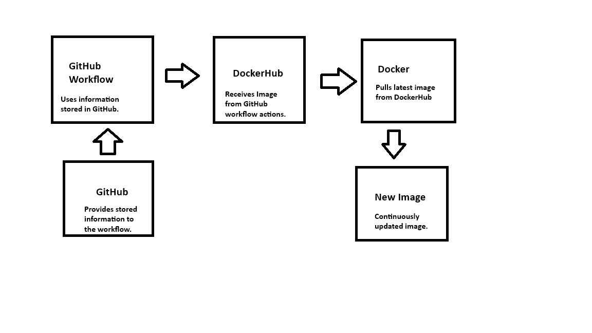

# Part 4 - Project Description & Diagram
1. Continuous Integration Project Overview
    - What is the goal of this project:
        - The goal of this project is to set up a continuous integration using GitHub Actions to automate the building of a Docker container for a web service and push it to DockerHub whenever a new release is created.
    - What tools are used in this project and what are their roles:
        - Docker: Used to create, deploy, and run applications in containers.
        - DockerHub: A cloud-based registry service for building and shipping Docker images.
        - GitHub Actions: A CI/CD platform that allows automation of software workflows directly in a GitHub repository.
        - GitHub Repository Secrets: Used to securely store sensitive information such as DockerHub credentials for use in GitHub Actions workflows.
    - Diagram of project:
        
        
    - [If applicable] What is **not working** in this project:
        - N/A
2. Resources Section
    - Note: this can be at document top, scattered within document as resources were used, or placed at bottom
    - Add resources used in the project by linking them and making a statement of how it was used.  If generative AI was used, state which platform and what prompts were given and again, a statement of how it was used.:
        ***Reasources are listed at the end of part 2 & 3. Part 1 was sourced from Project 3***

## **.:: Part1 ::.**
### **.: 1 :.**
### Building a Web Service Container
- **Create a Dockerfile using a plain text document and save it.** (The name must be all lowercase)
    - First Line: FROM
        - Used for setting the base image of the container. Below is an example for creating an Apache image with the latest version.
        - Example: FROM httpd:latest
    - Second Line: COPY
        - Used for copying files from the host to the container. In this case we're copying the web content files to Apache's httpd directory.
        - Example: COPY /web-content/ /usr/local/apache2/htdocs/
            - [Docker Site](web-content/docker.html) - Site with common Dockerfile commands.
            - [Linux Commands](web-content/index.html) - Site with common Linux commands.
            - [CSS File](web-content/style.css) - CSS file for both HTML files.
    
    - Dockerfile: [Dockerfile](dockerfile)
- **The command to create the container from this image**
    - docker build -t dockerfile:project3 .
        - "-t" creates the terminal interface for the container
        - "dockerfile" is the name of the file to copied.
        - "project3" is the name tag for the container.
- **Pushing the Container to DockerHub**
    - In a terminal, use "docker login" to log 
    - Tag the image with your Dockerhub username and the repository name.
        - docker tag "image name" "dockerhub username"/"repo name":"tag"
        - docker tag my_image user/repo_name:first_tag
    - Push the image to DockerHub
        - docker push "dockerhub username"/"repo name":"tag"
        - docker push user/repo_name:first_push
- **Create a Container from DockerHub**
    - Pull the image from DockerHub:
        - docker pull "dockerhub username"/"repo name":"tag"
    - Run the container:
        - docker run -d -p 8000:80 --restart unless-stopped "dockerhub username"/"repo name":"tag"
        
- **Creating a Personal Access Token (PAT)**
    - When logging in to DockerHub, use your PAT in place of your password.
    
### Instructions
1. Select your avatar in the top-right corner and from the drop-down menu select Account settings.
2. Select Personal access tokens.
3. Select Generate new token.
4. Configure your token:

    - Description: Use a descriptive name that indicates the token's purpose
    - Expiration date: Set an expiration date based on your security policies
    - Access permissions: Read, Write, or Delete. (Set to read & write to be able to push)
5. Select Generate. Copy the token that appears on the screen and save it. You won't be able to retrieve the token once you exit the screen.

## **.:: Part 2 ::.**
### **.: 1. Configuring GitHub Repository Secrets :.**
- **Creating a DockerHub PAT for GitHub Actions**
    - Click on your profile picture in the top right corner of Docker Hub and select Account Settings.
    - In the left sidebar, click Personal Access Tokens.
    - Click on the Generate Token button.
    - Give your token a descriptive name, select the desired expiration date, and choose the scope. (Read, Write, Delete - needed to push images)
    - Click on the Generate button to create the token.
    - Copy the generated token and store it securely, as you won't be able to view it again.
- **Set Repository Secrets in GitHub**
    - In your GitHub repository, go to the Settings tab and click on Secrets and variables under the Security section
    - Click on Actions
    - Click on New repository secret
    - Add the following secrets:
        - DOCKERHUB_USERNAME: Your DockerHub username.
        - DOCKERHUB_TOKEN: The PAT you generated from DockerHub.
- **Secrets Description**
    - DOCKERHUB_USERNAME: This secret stores your DockerHub username, which is needed for authentication when pushing Docker images to your DockerHub repository.
    - DOCKERHUB_TOKEN: This secret contains the Personal Access Token (PAT) generated from DockerHub. It is used for secure authentication and authorization when performing actions such as pushing Docker images to your DockerHub repository.

### **.: 2. CI with GitHub Actions :.**
- **Workflow Trigger**
    - The workflow is triggered on pushes to the main branch and when a new release is created.
- **Workflow Steps**
    - Checkout Repository: Uses the actions/checkout@v3 action to check out the repository code.
    - Set up Docker Buildx: Uses the docker/setup-buildx-action@v2 action to set up Docker Buildx for building multi-platform images.
    - Log in to DockerHub: Uses the docker/login-action@v2 action to log in to DockerHub using the secrets stored in the repository.
    - Build and Push Docker Image: Uses the docker/build-push-action@v4 action to build and push the Docker image to DockerHub. The image is tagged with both the latest tag and a version tag based on the release version.
- **Values that need updated if used in a different repository**
    - Things needed to be changed in the workflow file:
        - Replace your dockerhub username with your new DockerHub username.
        - Replace your repo name with the name of your DockerHub repository where the image will be pushed.
        - Replace the github information with your new GitHub repository information.
    - Things needed to be changed in the repository:
        - Update the Dockerfile if necessary to match the web content or application you want to containerize.
- **GitHub Actions Workflow File**
    - [Workflow File](https://github.com/WSU-kduncan/cicdf25-T-re-v/blob/main/.github/workflows/actions.yml)

### **.: 3. Testing & Validating :.**
- **Test the Workflow**
    - Make a change and push it to the main branch of your GitHub repository to trigger the workflow.
- **Verify the image in DockerHub works correctly**
    - Monitor the Actions tab in your GitHub repository to see the progress of the workflow.
    - Ensure that all steps complete successfully without errors.
    - Pull the Docker image from DockerHub to your local machine using the docker pull command and run it to verify that it works as expected.
- **DockerHub Repository**
    - [DockerHub Repository](https://hub.docker.com/repository/docker/spootymcspoot/project3/general)

**Resources:** [GitHub Secrets And Variables](https://docs.github.com/en/actions/how-tos/write-workflows/choose-what-workflows-do/use-secrets), [GitHub Workflows](https://www.geeksforgeeks.org/git/github-workflows/), [Checkout Action](https://github.com/marketplace/actions/checkout), [Setup Docker Buildx Action](https://github.com/docker/setup-buildx-action/releases), [Login Action](https://github.com/docker/login-action/pkgs/container/login-action)

## **.:Part 3 - Semantic Versioning:.**

### **.: 1 :.**
- **Generating Tags**
    - See Tags: Click the code tab, then click the "main" branch dropdown and select "Tags" to view existing tags.
    - Generate a tag: Click the "Create new tag" button, enter the tag name following semantic versioning (e.g., v1.0.0), and click "Create tag".
        - In a terminal, use the command: git tag -a v\*.\*.\*
    - Push a Tag:
        - In a terminal, use the command: git push --tags
### **.: 2 :.**
- **Workflow Trigger**
    - The workflow is triggered on tag pushes to the repository.
- **Workflow Steps**
    - Checkout Repository: Uses the actions/checkout@v3 action to check out the repository code.
    - Set up Docker Buildx: Uses the docker/setup-buildx-action@v2 action to set up Docker Buildx for building multi-platform images.
    - Log in to DockerHub: Uses the docker/login-action@v2 action to log in to DockerHub using the secrets stored in the repository.
    - Build and Push Docker Image: Uses the docker/build-push-action@v4 action to build and push the Docker image to DockerHub. The image is tagged with both the latest tag and a version tag based on the release version.
- **Values that need updated if used in a different repository**
    - Things needed to be changed in the workflow file:
        - Replace your dockerhub username with your new DockerHub username.
        - Replace your repo name with the name of your DockerHub repository where the image will be pushed.
        - Replace the github information with your new GitHub repository information.
    - Things needed to be changed in the repository:
        - Update the Dockerfile if necessary to match the web content or application you want to containerize.
- **GitHub Actions Workflow File**
    - [Workflow File](https://github.com/WSU-kduncan/cicdf25-T-re-v/blob/main/.github/workflows/actions.yml)
### **.: 3 :.**
- **Test the Workflow**
    - Make a change and push it to the main branch of your GitHub repository to trigger the workflow.
- **Verify the image in DockerHub works correctly**
    - Monitor the Actions tab in your GitHub repository to see the progress of the workflow.
    - Ensure that all steps complete successfully without errors.
    - Pull the Docker image from DockerHub to your local machine using the docker pull command and run it to verify that it works as expected.
- **DockerHub Repository**
    - [DockerHub Repository](https://hub.docker.com/repository/docker/spootymcspoot/project3/general)

**Resources:** [GitHub Secrets And Variables](https://docs.github.com/en/actions/how-tos/write-workflows/choose-what-workflows-do/use-secrets), [GitHub Workflows](https://www.geeksforgeeks.org/git/github-workflows/), [Checkout Action](https://github.com/marketplace/actions/checkout), [Setup Docker Buildx Action](https://github.com/docker/setup-buildx-action/releases), [Login Action](https://github.com/docker/login-action/pkgs/container/login-action)